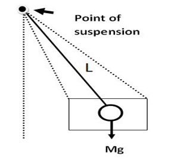
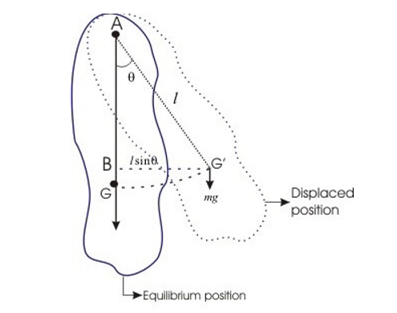
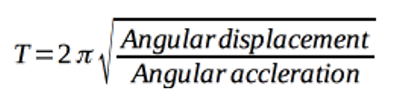
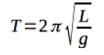
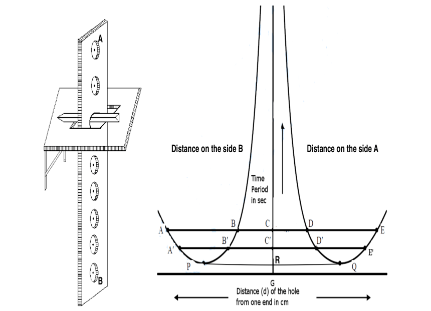

<h4>What is Compound Pendulum?</h4>
A compound pendulum weights bar which is in swing mode and it freely oscillates about the horizontal access. The time period of the compound pendulum is measured from the centre of oscillation to the pivot level. The compound pendulum is also known as the Physical pendulum.  

<h5>Radius of oscillation of compound pendulum = I/ (m × R) </h5>

where, 
•	I is inertia 
•	m is mass, and  
•	R is the distance between the centre of mass and pivot value. 

<h5>Time period of compound pendulum= 2 × π(√(I/mgR)) </h5>

where, 
g is the acceleration due to gravity. 

<h4>•	General diagram of the compound pendulum is shown below.</h4>

There exist different kinds of pendulums like simple, compound, double, and Kater’s pendulum. Typically, a simple pendulum consists of a small body called a “bob” (usually a sphere) attached to the end of a string of certain the length whose mass is negligible in comparison with that of the bob. But this simple pendulum is a more ideal kind of pendulum and cannot be realized in actual practice. Most of the hard to achieve defects are removed by introducing the concepts of compound pendulum.  
Any swinging rigid body free to rotate about a fixed horizontal axis is called a compound pendulum or physical pendulum.  
A compound pendulum consists of a rigid body that can oscillate freely about a horizontal axis passing through it.
The appropriate equivalent length L for calculating the period of any such pendulum is the distance from the pivot to the centre of oscillation.
Figure below shows a compound pendulum where a body of mass M is pivoted about a horizontal frictionless axis through A and G' is the point after displaced from its equilibrium position by an angle θ. The distance between G’ and A is 𝑙.
  

 
As the angular acceleration is proportional to angular displacement, the motion of the compound pendulum is simple harmonic and its time period 𝑇 is given by
  

 
And length of an equivalent simple pendulum is  

 

<h3>Description:</h3>

The bar pendulum consists of a metallic bar of about one meter long. A series of circular holes each of approximately 5 mm in diameter are made along the length of the bar. The bar is suspended from a horizontal knife-edge passing through any of the holes.The knife-edge, in turn, is fixed in a platform provided with the screws. By adjusting the rear screw, the platform can be made horizontal.

